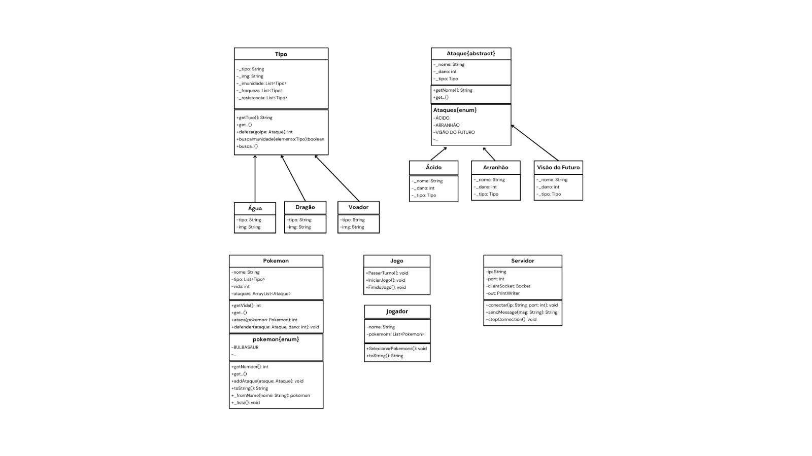

Grupo: 

- Giancarlo Bonvenuto - 248527
- Thiago
- Pedro
- Pedro Henrique Pinheiro Linhares - 175807

# Como executar

Primeiro clone o repositório:

`git clone https://github.com/gBonvenuto/Pokemon-MC322`

Em seguida compile os arquivo:

`javac -d bin -sourcepath src src/main/java/main/Main.java src/main/java/utils/* src/main/java/tipos/* src/main/java/ataques/*`

E então rode o jogo

`java -cp main.Main`

# Pokemon-MC322 V-1.0
Projeto de pokemon no Terminal para a disciplina de MC322
## Descrição do projeto

### O Projeto é composto algumas pastas como utils, ataques e tipos:
- Na pasta de **utils** nós temos a declaração dos arquivos **Ataque.java**, **Tipo.java**, **Jogador.java**, **Pokemon.java**, **Servidor.java** e **Jogo.java** que servem de base para a construção dos Pokemons e dos Ataques dos Pokemons;
- Obs: O arquivo de tipo vai ser uma classe abstrata, enquanto o arquivo de Ataques é uma classe mãe normal;
- Na pasta de **Ataques** nós temos uma coletânea de alguns ataques que serão, mais tarde atribuídos à cada pokemon de forma totalmente aleatória levando em consideração o seu tipo;
- Na pasta de **tipos** nós vamos ter uma coletânea dos tipos mais famosos de pokemons, da primeira geração, levando em consideração as suas fraquezas, vantagens e eventuais imunidades;
- **Pokemon**: A classe pokemon vai possuir as funções necessárias para a manipulação e instanciação de um pokemon ao time do jogador e funcionamento em uma futura batalha; Alguns exemplos de funções importantes são a função de ataque e defesa, a função ataque vai retornar um valor int do dano, enquanto a função defesa vai receber esse valor como argumento e, juntamente do tipo do pokemon, fazer o cálculo do que vai ser realmente retirado da vida total do pokemon;

### Para a próxima versão:
- Início da lógica de jogo;
- implementação de um servidor para possibilitar interação multiplayer;
